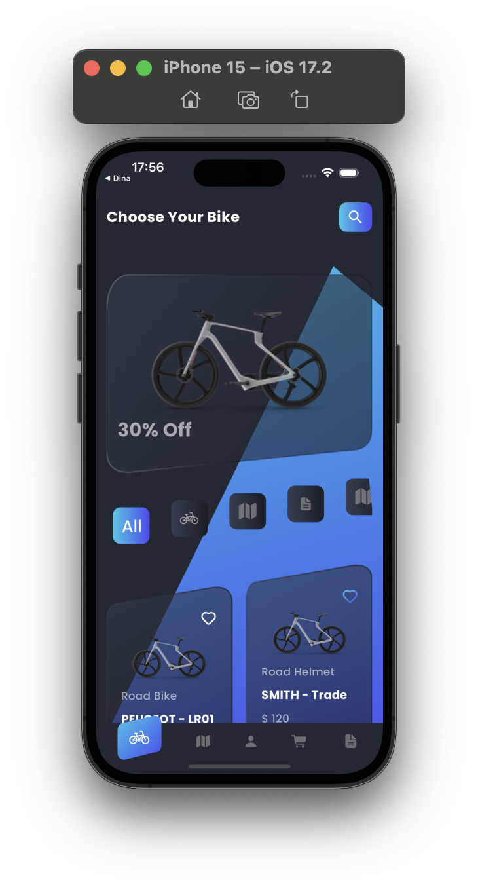
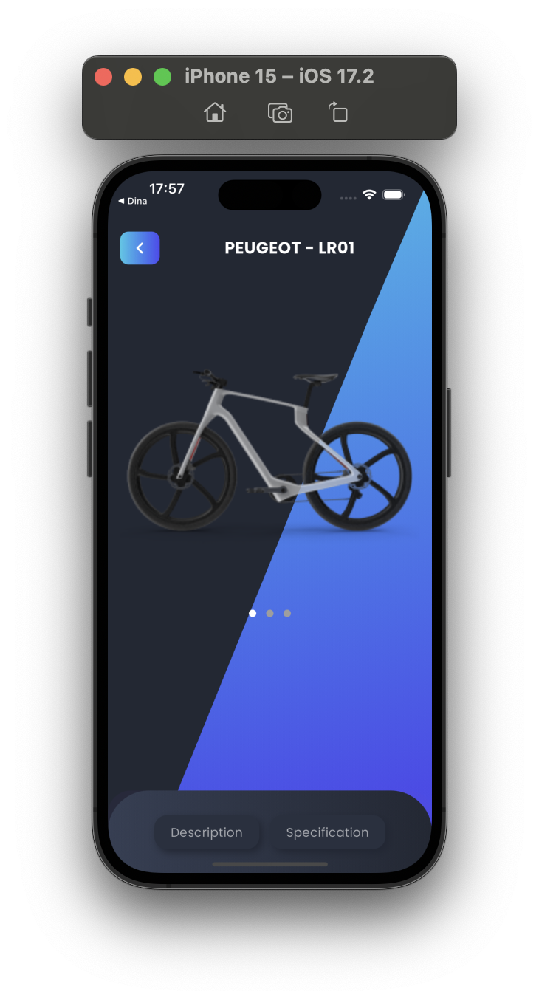
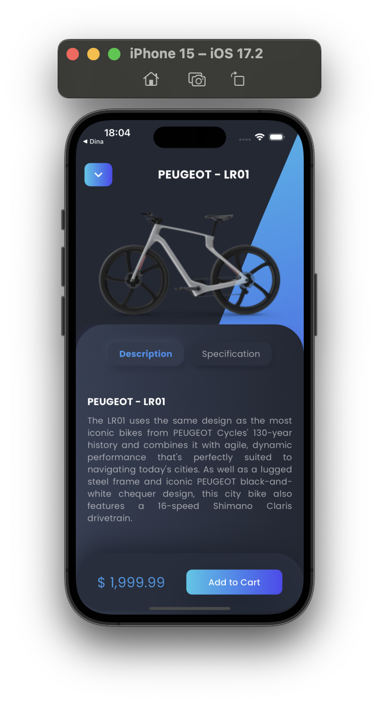
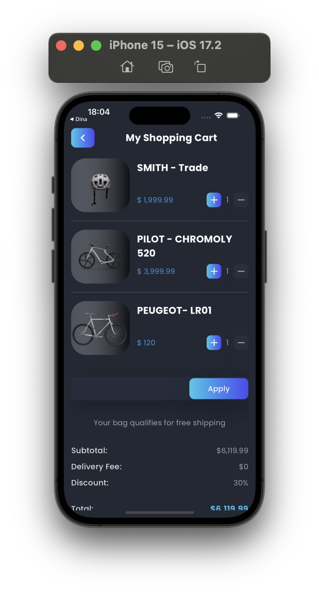

 #  Online-Bike-Shopping-App

This project is a demonstration of designing an advanced user interface with Flutter.
 Using features like clip paths, animations and transforms.

## Preview

    
    
    
    

## Short video

https://youtube.com/shorts/PIR6yembPJw?si=mjiREwI9L2HxhNMN

## Design link
https://www.figma.com/file/D8e9p9L3AeUfNnsIvRzMcy/Online-Bike-Shopping-App-(Community)?node-id=1%3A4&mode=design

## Advanced Flutter Concepts

- Clip Path 
- Transforms
- Animations 

## Installation

1. Clone this repository :
git clone https://github.com/savykevin100/Online-Bike-Shopping-App.git

2. Navigate to the project directory :
cd Online-Bike-Shopping-App

3. Run the application:
flutter run

## Contact
SAVY Kévin - https://www.linkedin.com/in/k%C3%A9vin-savy-6153581b6/ - savykevin100@gmail.com

Project Link: https://github.com/savykevin100/Online-Bike-Shopping-App.git